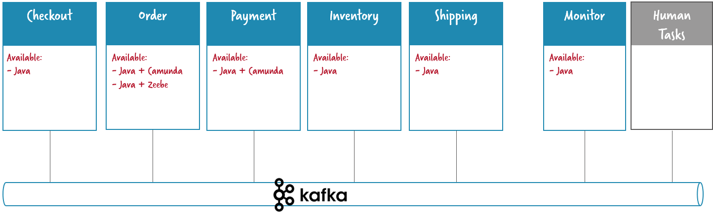

# Flowing Retail / Apache Kafka / Java

This folder contains services written in Java that connect to Apache Kafka as means of communication between the services.

Tech stack:

 * Java 8
 * Spring Boot 1.5.x
 * Spring Cloud Streams
 * Apache Kafka

A continuación se muestra un diagrama de los servicios de los que vamos a hacer uso.



## Ejecutar la aplicación

Para lanzar todos los servicios ejecute el siguiente comando.

```
 $ make run
```

Una vez que todos los servicios estén levantados:

* Lanzar un nuevo "Order" [http://localhost:8090](http://localhost:8090)
* Podemos inspeccionar el servicios de "Order" [http://localhost:8091](http://localhost:8091)
* Podemos inspeccionar el servicios de "Payment" [http://localhost:8092](http://localhost:8092)
* Podemos monitorizar los eventos del sistemas en  [http://localhost:8095](http://localhost:8095)

Las credenciales de acceso a los servicios de Order y Payment son:

 * user: `demo`
 * password: `demo`

## Referencias

 * https://blog.bernd-ruecker.com/flowing-retail-demonstrating-aspects-of-microservices-events-and-their-flow-with-concrete-source-7f3abdd40e53
